# Raspberry Pi 5B NTP Server - Stratum 1 (with Uputronics GPS HAT)
A straightforward and optimized approach to achieve a cost-effective (€200) Stratum 1 NTP server, disciplined with highly precise PPS (Pulse Per Second) sourced from the GPS radio service plus NTP public servers across the internet to get the absolute time reference.

Can be prepared to be used with *off-the-grid* applications such as IoT in remote locations/air-gapped systems or WAN connected IoT ones (as presented here).

The end result with a Raspberry Pi 5B and an Uputronics GPS/RTC HAT Ublox M8 engine vs 6.4:

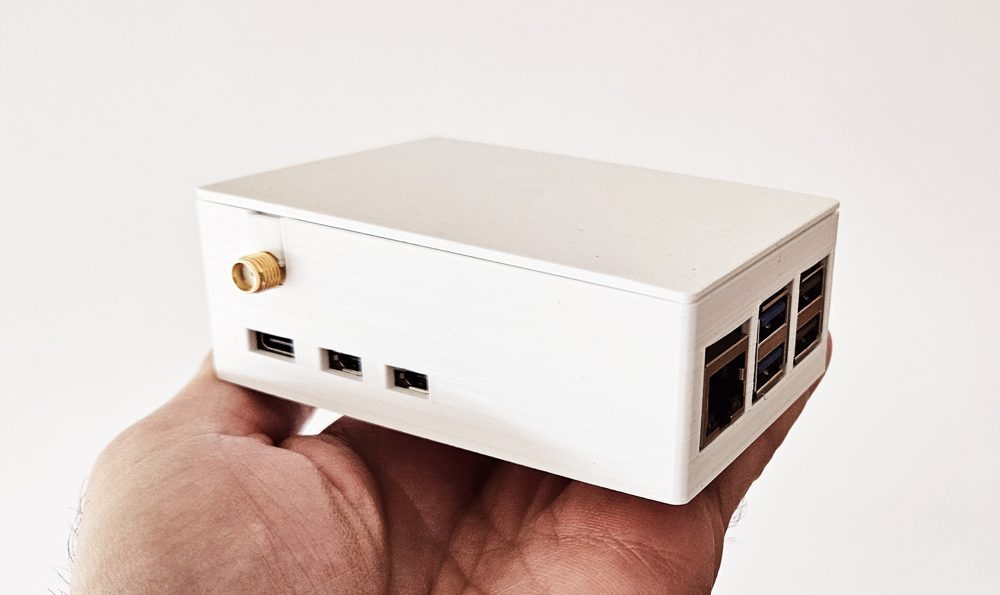

This is my recipe for Raspberry PI OS lite `Bookworm`, kernel 6.1.72-v8-16k+.


# Index

- [Achievements](./README.md#achievements--january-2024)
- [List of materials and tools needed](./README.md#list-of-materials-and-tools-needed)
- [Setup the server](./README.md#setup-the-server)
- [Advanced Ublox M8 chip tuning](./README.md#advanced-ublox-m8-chip-tuning)
- [Advanced system tuning](./README.md#advanced-system-tuning)
- [References](./README.md#references)


## Achievements @ January 2024:
- [X] precision of 2^-26 (~15 ns).
- [X] ns local clock timekeeping (std dev < 200 ns on PPS source).
- [X] ns timekeeping across multiple networks (RMS offset < 40 ns).
- [X] stable operation with low frequency value (usually ~ 3 ppm).
- [X] serve time to more than 160 clients (capable of many more).
- [X] optimize the Ublox M8 chip for better timming accuracy.
- [X] set the serial baudrate to its maximum (up to 115200 bps).
- [X] provide hardware timestamping for NTP and PTP packets on the Rpi 5B.
- [X] provide PTP Hardware Clock (PHC) support under Chrony
- [X] disable the internal hardware RTC DA9091 on the Rpi 5B.
- [X] add support for the high precision RTC RV3028.
- [X] disable GLONASS GNSS usage #slavaukraini
- [ ] correct the timekeeping skew from CPU temperature flutuation.

Chrony vs 4.5 `server` tracking statistics after 1 day of uptime:

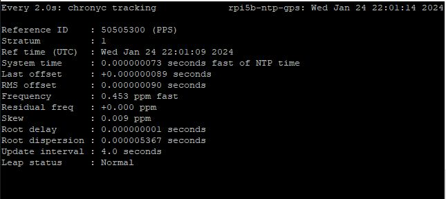

Chrony vs 4.0 `client` tracking statistics after 1 day of uptime:

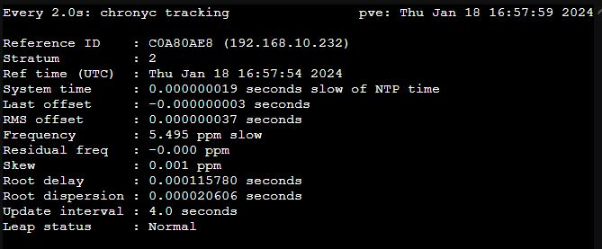

Chrony vs 4.0 `client` tracking ntpdata of this server, after 1 day of uptime:

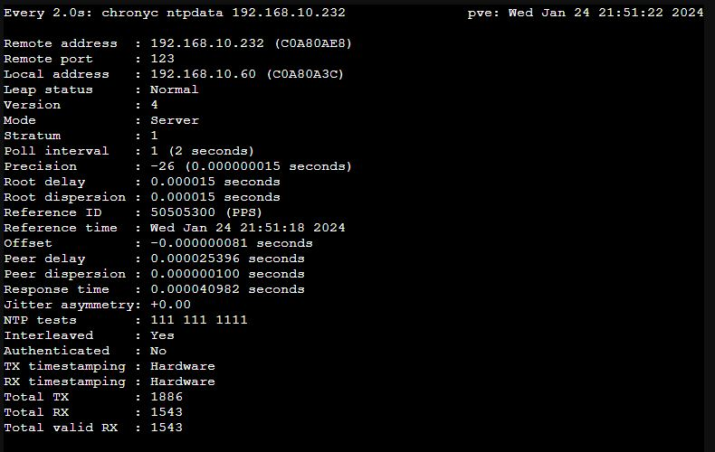

## Checklist aiming a low latency and jitter environment @ January 2024:
- [X] Research system hardware topology, using lscpu 
- [X] Determine which CPU sockets and I/O slots are directly connected.
- [X] Follow hardware manufacturer`s guidelines for low latency hardware tuning.
- [X] Ensure that adapter cards are installed in the most performant I/O.
- [X] Ensure that CPU/memory/storage is installed and operating at its **nominal** supported frequency.
- [X] Make sure the OS is fully updated.
- [X] Enable network-latency tuned overlay settings.
- [X] Verify that power management settings are correct and properly setup.
- [X] Stop all unnecessary services/processes.
- [ ] Unload unnecessary kernel modules *(to be assessed)*
- [X] Apply low-latency kernel command line setup(s).
- [X] Perform baseline latency tests.
- [X] Iterate, making isolated tuning changes, testing between each change.


# List of materials and tools needed

**Mandatory**:
- 40 pin header 10mm spacer (if using the genuine active cooler)
- SD Card with 8GB or more
- USB SD Card reader or other similar device to install Raspberry PI OS on the SD Card.
- Raspberry PI 5B, with a suitable power adaptor
- Uputronics GPS HAT
- RJ45 Ethernet CAT5 (or better) cable with proper lenght

**Optional** :
- 3D printed case for housing the fully assembled server **(RPI 5B)**:
  > I suggest this [custom made case](./files/Rpi%205b%20case%20all%20v3.3mf).
  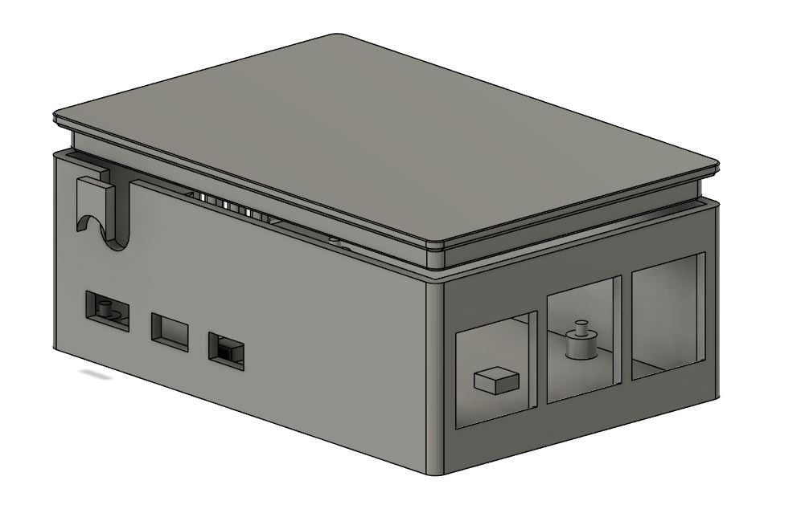
  > PLA or PETG are generally appropriate, depending on the ambient temperature and environment you`ll apply this server in.
- Outdoor GPS active antenna with 28dB Gain, inline powered at 3-5V DC, with 5 meters of cable lenght and SMA male connector

# Setup the server

## Upgrade your system and install the required software

### GPS Expansion Board from Uputronics 
> sudo apt update && sudo apt upgrade -y
> 
> sudo apt install gpsd gpsd-tools gpsd-clients pps-tools chrony minicom setserial i2c-tools python3-smbus -y


## Disable the serial TTY (linux console) on the UART interface
> sudo systemctl disable --now serial-getty@ttyAMA0.service
> 
> sudo systemctl disable --now hciuart


## Disable the kernel support for the serial TTY
> sudo nano /boot/cmdline.txt

Remove this ```console=serial0,115200``` and this (if applicable) ```kgdboc=ttyAMA0,115200``` sequence(s) only and save.


## Configure the Raspberry Pi

Add this to your `/boot/config.txt` file:

```
[pi5]
# To enable hardware serial UART interface over GPIO 14 and 15 (specific for 5B model)
dtparam=uart0_console=on

# Enable uart 0 on GPIOs 14-15. Pi 5 only.
dtoverlay=uart0-pi5

# Disables the undocumented terrible RPi 5B RTC DA9091
dtparam=rtc=off

[all]
# Uses the /dev/ttyAMA0 UART GPS instead of Bluetooth
dtoverlay=miniuart-bt

# Disables Bluetooth for better accuracy and lower interferance - optional
dtoverlay=disable-bt

# Disables Wifi for better accuracy and lower interferance - optional
dtoverlay=disable-wifi

# For GPS Expansion Board from Uputronics
dtparam=i2c_arm=on
dtoverlay=i2c-rtc,rv3028
dtoverlay=pps-gpio,gpiopin=18
init_uart_baud=115200

# Disables kernel power saving
nohz=off

# Disables Energy Efficient Ethernet - improves jitter and lag (~200us)
dtparam=eee=off

# Force CPU high speed clock
force_turbo=1
```

## Remove the support to receive NTP servers through DHCP
> sudo rm /etc/dhcp/dhclient-exit-hooks.d/timesyncd
> 
> sudo nano /etc/dhcp/dhclient.conf

Remove the references for `dhcp6.sntp-servers` and `ntp-servers`

## Disable and stop systemd-timesyncd to eliminte conflicts with chrony later on
> sudo systemctl disable --now systemd-timesyncd

## Decrease the serial latency for improved accuracy and stability
> sudo nano /etc/udev/rules.d/gps.rules

Add the content:

```
KERNEL=="ttyAMA0", RUN+="/bin/setserial /dev/ttyAMA0 low_latency"
```

## Force the CPU governor from boot, being always `performance`, aiming better timekeeping resolution
> sudo sed -i `s/CPU_DEFAULT_GOVERNOR="\${CPU_DEFAULT_GOVERNOR:-ondemand}"/CPU_DEFAULT_GOVERNOR="\${CPU_DEFAULT_GOVERNOR:-performance}"/; s/CPU_ONDEMAND_UP_THRESHOLD="\${CPU_ONDEMAND_UP_THRESHOLD:-50}"/CPU_ONDEMAND_UP_THRESHOLD="\${CPU_ONDEMAND_UP_THRESHOLD:-10}"/; s/CPU_ONDEMAND_DOWN_SAMPLING_FACTOR="\${CPU_ONDEMAND_DOWN_SAMPLING_FACTOR:-50}"/CPU_ONDEMAND_DOWN_SAMPLING_FACTOR="\${CPU_ONDEMAND_DOWN_SAMPLING_FACTOR:-10}"/` /etc/init.d/raspi-config


## Disable the fake hardware clock, on Raspberry Pi OS
> sudo systemctl disable --now fake-hwclock
> sudo update-rc.d -f fake-hwclock remove
> sudo apt-get remove fake-hwclock -y
> sudo sed -i `/if \[ -e \/run\/systemd\/system \] ; then/,/\/sbin\/hwclock --rtc=$dev --hctosys/ s/^/#/` /lib/udev/hwclock-set
	

## Reboot to apply the system configurations
> sudo reboot

## For GPS Expansion Board from Uputronics
Confirm the i2c interfaces are working for the RTC (`52` or `UU` at the `0x52` address) and the GPS (`42` or `UU` at the `0x42` address) 
> sudo i2cdetect -y 1

The Output should be similar to:
```
     0  1  2  3  4  5  6  7  8  9  a  b  c  d  e  f
00:                         -- -- -- -- -- -- -- -- 
10: -- -- -- -- -- -- -- -- -- -- -- -- -- -- -- -- 
20: -- -- -- -- -- -- -- -- -- -- -- -- -- -- -- -- 
30: -- -- -- -- -- -- -- -- -- -- -- -- -- -- -- -- 
40: -- -- 42 -- -- -- -- -- -- -- -- -- -- -- -- -- 
50: -- -- UU -- -- -- -- -- -- -- -- -- -- -- -- -- 
60: -- -- -- -- -- -- -- -- -- -- -- -- -- -- -- -- 
70: -- -- -- -- -- -- -- --                         
```
## Check the rv3028 RTC time
> sudo hwclock -r

If it does return the following error, instead of a date-time stamp:

```hwclock: ioctl(RTC_RD_TIME) to /dev/rtc0 to read the time failed: Invalid argument```

Execute the following command:
> sudo hwclock --systohc -D --noadjfile --utc && sudo hwclock -r

## Setup the GPSd daemon
> sudo nano /etc/default/gpsd

Replace all the content with:

```
START_DAEMON="true"
USBAUTO="false"
DEVICES="/dev/ttyAMA0 /dev/pps0″
GPSD_OPTIONS="--nowait --badtime --passive --speed 115200"
```

## Restart the GPSd service
> sudo systemctl restart gpsd


> [!NOTE]
> **For Uputronics GPS Extension Board:**
> Since V3.00 of the Ublox firmware the time pulse is not released until all time parameters are known including leap seconds. 
> There it could be up to 12.5 minutes before time pulse is available however positional lock is achieved from cold in the expected sub 30 seconds.


## Setup chrony as the service for the NTP server
> sudo nano /etc/chrony/chrony.conf 

Replace all the content with:

```
# Welcome to the chrony configuration file. See chrony.conf(5) for more
# information about usable directives.

# Include configuration files found in /etc/chrony/conf.d.
confdir /etc/chrony/conf.d

# ** CHANGE THIS ** -- DISABLE THIS FOR ISOLATED/AIRGAPED SYSTEMS
pool 0.pool.ntp.org iburst minpoll 5 maxpoll 5 polltarget 16 maxdelay 0.030 maxdelaydevratio 2 maxsources 6
pool 1.pool.ntp.org iburst minpoll 5 maxpoll 5 polltarget 16 maxdelay 0.030 maxdelaydevratio 2 maxsources 6

# ENABLE THIS FOR ISOLATED/AIRGAPED SYSTEMS
#cmdport 0

# Use NTP sources found in /etc/chrony/sources.d.
sourcedir /etc/chrony/sources.d

# This directive specify the location of the file containing ID/key pairs for
# NTP authentication.
keyfile /etc/chrony/chrony.keys

# This directive specify the file into which chronyd will store the rate
# information.
driftfile /var/lib/chrony/chrony.drift

# Save NTS keys and cookies.
ntsdumpdir /var/lib/chrony

# Set the NTS intermediate certificates
#ntsserverkey /etc/pki/tls/private/foo.example.net.key
#ntsservercert /etc/pki/tls/certs/foo.example.net.crt
#ntsratelimit interval 3 burst 1 leak 2


# Uncomment the following line to turn logging on.
#log tracking measurements statistics 
log rawmeasurements measurements statistics tracking refclocks tempcomp

# Log files location.
logdir /var/log/chrony

# The lock_all directive will lock chronyd into RAM so that it will
# never be paged out. This mode is only supported on Linux. This
# directive uses the Linux mlockall() system call to prevent chronyd
# from ever being swapped out. This should result in lower and more
# consistent latency.
lock_all

# Stop bad estimates upsetting machine clock.
maxupdateskew 100.0

# Use it as reference during chrony startup in case the clock needs a large adjustment.
# The 1 indicates that if the system’s error is found to be 1 second or less, a slew will be used to correct it; if the error is above 1 secods, a step will be used.
initstepslew 1 time.facebook.com time.google.com

# enables response rate limiting for NTP packets - reduce the response rate for IP addresses sending packets on average more than once per 2 seconds, or sending packets in bursts of more than 16 packets, by up to 75% (with default leak of 2).
ratelimit interval 1 burst 16 leak 2

# specifies the maximum amount of memory that chronyd is allowed to allocate for logging of client accesses and the state that chronyd as an NTP server needs to support the interleaved mode for its clients. 
# 1GB
clientloglimit 10000000

# This directive enables kernel synchronisation (every 11 minutes) of the
# real-time clock. Note that it can’t be used along with the `rtcfile` directive.
rtcsync

# Step the system clock instead of slewing it if the adjustment is larger than
# one second, but only in the first three clock updates.
makestep 1 3

# Get TAI-UTC offset and leap seconds from the system tz database.
# This directive must be commented out when using time sources serving
# leap-smeared time.
leapsectz right/UTC

# Defining the networks allowed to access the service - DISABLE THIS FOR ISOLATED/AIRGAPED SYSTEMS
allow

# Expedited Forwarding DSCP directive traffic
dscp 48

# enables hardware timestamping for Rpi 5B
hwtimestamp *

# set larger delay to allow the NMEA source to overlap with
# the other sources and avoid the falseticker status
# https://chrony.tuxfamily.org/faq.html#using-pps-refclock
refclock SHM 0 poll 8 refid GPS precision 1e-1 offset 0.130 delay 0.2 noselect

# Choose the one with best long term results
refclock SHM 1 refid PPS precision 1e-7 prefer
refclock kPPS /dev/pps0 lock GPS maxlockage 2 poll 4 refid PPS precision 1e-7 prefer 

# Compares and saves the SoC temperature with the temperature correlation table bellow, every 30 seconds - future improvement
tempcomp /sys/class/thermal/thermal_zone0/temp 30 /etc/chrony/chrony.tempcomp
```

## Create a simple and innocuous temperature calibration file for chrony
> sudo nano /etc/chrony/chrony.tempcomp 

Add the content:

```
20000 0
21000 0
25000 0
30000 0
35000 0
40000 0
45000 0
50000 0
55000 0
60000 0
65000 0
```

## Restart the chrony service
> sudo systemctl restart chronyd.service


## Check the sources for correct operation
> watch chronyc sources -v

> [!IMPORTANT]
> Wait for 15 minutes, at least, allowing the system clock to converge into a proper offset range, around sub milisecond.

# Advanced Ublox M8 chip tuning

> [!WARNING] 
> This is optional! Proceed with caution and at your own risk!

Using U-Center vs 23.08 or better, open the communication through an USB-C cable with the GPS HAT, on a Windows PC. Open the Configuration Console (CTRL+F9) and edit accordingly:

## NMEA - Enable support for GALILEO GNSS.

Change the `NMEA Version` to "4.10". This should ativate NMEA support for the GALILEO messages.

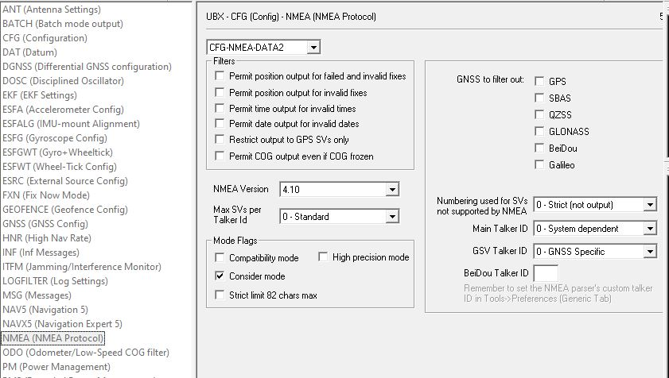

## GNSSs

Enable the GNSSs of your choise. Here, for Europe, I'm using `GPS`, `GALILEO` and the SBAS `EGNOS` (no longer `GLONASS`):

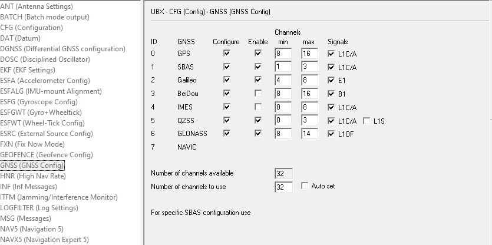

## ITFM (Jamming/Interferance Monitor)

Click on `enable Jamming/Interferance Monitor` to enable it and change `Antenna Type` to "2 - Active" (if applicable).

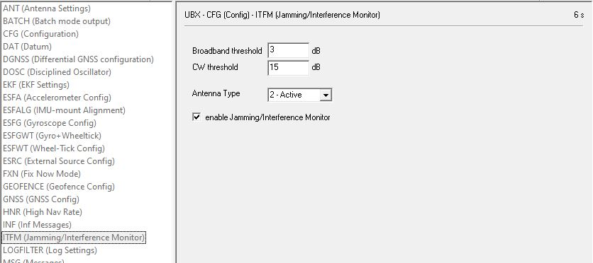

## NAV5 - Stationaty Dynamic Model

Change `Dynamic Model` to "2 - Stationary", to improve the timming accuracy on the device.

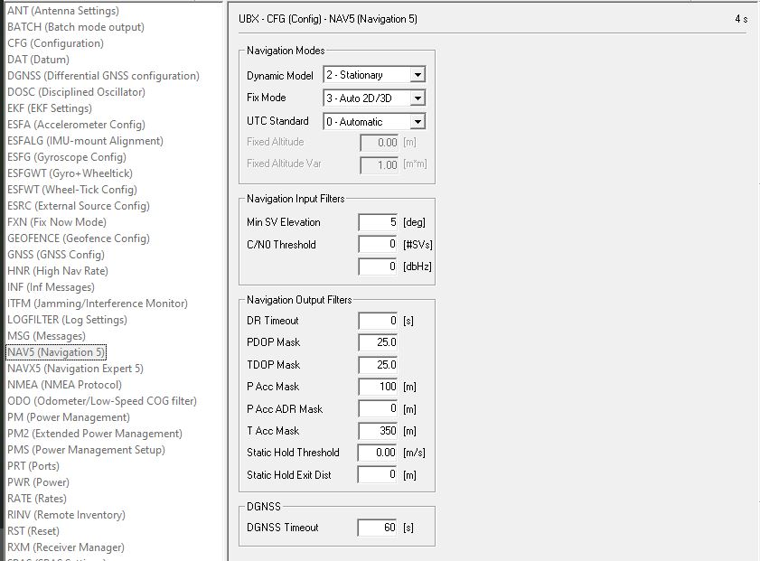

## PMS - Power Management Setup

Change `Setup ID` to "0 - Full Power" to allow a small gain on better timming accuracy.

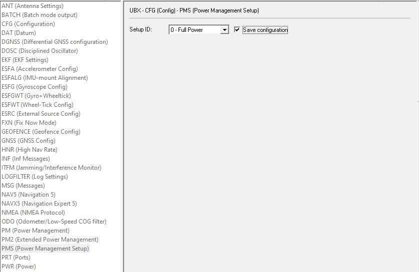

## TP5 - Time Pulse refinement

Change `Cable Delay` value to the one fitting your setup. For example, with the uBlox ANN-MB Active GPS Patch Antenna and 5 meters of RG-174 cable, the expected value should be "25" nanoseconds.

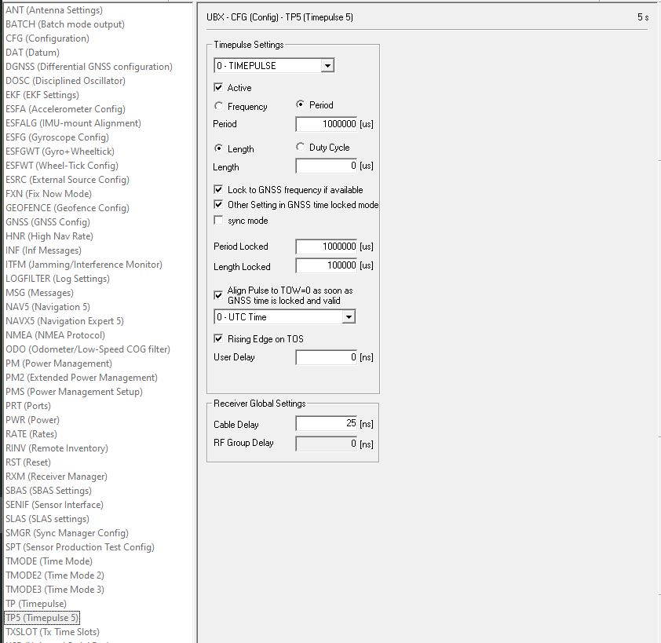

## Saving settings to EEPROM

Click on `Send`, at the lower left corner.

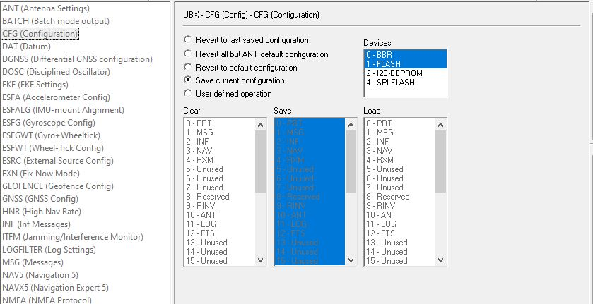

# Advanced system tuning

> [!WARNING] 
> This is optional! Proceed with caution and at your own risk!

## Check and acknowledge the logical topology of your particular SoC setup, on the PNG image generated
> sudo apt update && sudo apt install hwloc -y
>
> lstopo --logical --output-format png > \`hostname\`.png

## Check and acknowledge the pinout of this GPS HAT
- GPS Expansion Board from Uputronics: https://pinout.xyz/pinout/uputronics_gps_expansion_board

## Improve Chrony process priority, using systemd
Due to the Chrony software has not the mechanism to reduce itself its `nice` process value, we'll force it through systemd:

> sudo sed -i '/\[Service\]/a Nice=-10' /usr/lib/systemd/system/chrony.service
>
> sudo systemctl daemon-relead
> 
> sudo systemctl restart chrony


## Disable and stop unnecessary services, reducing cpu time consumption, latency and jitter
> sudo systemctl disable --now alsa-restore.service
>
> sudo systemctl disable --now alsa-state.service
>
> sudo systemctl disable --now alsa-utils.service
>
> sudo systemctl disable --now apt-daily-upgrade.timer
>
> sudo systemctl disable --now apt-daily.timer
>
> sudo systemctl mask apt-daily-upgrade.service
>
> sudo systemctl mask apt-daily.service
>
> sudo systemctl disable --now avahi-daemon.service
>
> sudo systemctl disable --now bluetooth.service
>
> sudo systemctl disable --now bthelper@.service
>
> sudo systemctl disable --now triggerhappy.service
>
> sudo systemctl disable --now rpi-display-backlight.service
>
> sudo systemctl disable --now systemd-timesyncd.service
>
> sudo systemctl disable --now wpa_supplicant.service
>
> sudo systemctl disable --now x11-common.service

## Allocate the strictly minimum RAM from GPU to the OS system, as running headless
Add this to your `/boot/config.txt` file under the `[ALL]`section:

```
# Allocates the base minimum gpu memory, as running headless
gpu_mem=16mb
``` 

## De-activates sound, aiming less resources and latency expected, as running headless
Change this on your `/boot/config.txt` file, to:

```
# De-activates sound, aiming less resources, fewer latency and interferance expected, for a headless server
dtparam=audio=off
```

## Auto-restart 10 seconds after a Kernel panic
The Raspberry Pi OS does not have this setting, useful in extreme cases, forcing a full system restart.

> echo "kernel.panic = 10" | sudo tee /etc/sysctl.d/90-kernelpanic-reboot.conf >/dev/null


## Remove the unneeded support for 2G/3G/4G/5G modems

> sudo apt remove --purge modemmanager -y
> 
> sudo apt autoremove --purge -y

## Disable the support for Swap
> sudo nano /boot/cmdline.txt

Add this ```noswap```, after this ```rootfstype=ext4```, and save.

## Disable sdcard swapping for improving its lifespan and reducing unnecessary I/O latency
> sudo dphys-swapfile swapoff
>
> sudo dphys-swapfile uninstall
>
> sudo update-rc.d dphys-swapfile remove
>
> sudo reboot


## Enable support for PTP Hardware Clock (PHC) on the Ethernet chip

Raspberry Pi 5 has a PTP clock within the Ethernet chip, so we leverage that to have another high performance reference clock in Chrony. 

As chronyd does	not synchronise	the NIC	clock, it assumes the clock is running free. So, we need to use ptp4l and phc2sys to sync the PHC with the system time.

> sudo apt update && sudo apt install linuxptp -y

Create a new file `/etc/linuxptp/ptp4l.conf` just with this:

> sudo nano /etc/linuxptp/ptp4l.conf

```
[global]
# Only syslog every 1024 seconds
summary_interval 10

# Increase priority to allow this server to be chosen as the PTP grandmaster.
priority1 10
priority2 10

[eth0]
# My LAN does not have hardware switches compatible with Layer-2 PTP, just Layer-3 PTP.
network_transport UDPv4
delay_mechanism E2E
```

Create a systemd service for ptp4l:

> sudo nano /etc/systemd/system/ptp4l.service

Add this:

```
[Unit]
Description=Precision Time Protocol service
Documentation=man:ptp4l
After=network-online.target

[Service]
Type=simple
ExecStart=/usr/sbin/ptp4l -f /etc/linuxptp/ptp4l.conf
Nice=-10

[Install]
WantedBy=multi-user.target
```

Then, enable and start the ptp4l service:

> sudo systemctl enable --now ptp4l.service


Create a systemd service for phc2sys:

> sudo nano /etc/systemd/system/phc2sys.service

```
[Unit]
Description=Synchronizing PTP Hardware Clock from system time
Documentation=man:phc2sys
After=ptp4l.service

[Service]
Type=simple
ExecStart=/usr/sbin/phc2sys -s CLOCK_REALTIME -c eth0 -w -u 1024
Nice=-10

[Install]
WantedBy=multi-user.target
```

Then, enable and start the phc2sys service:

> sudo systemctl enable --now phc2sys.service


Add this new `refclock` into the 

>  sudo nano /etc/chrony/chrony.conf

```
refclock PHC /dev/ptp0 tai refid PHC poll 0
```

Check under the `sources` that your new `refclock` is working properly.

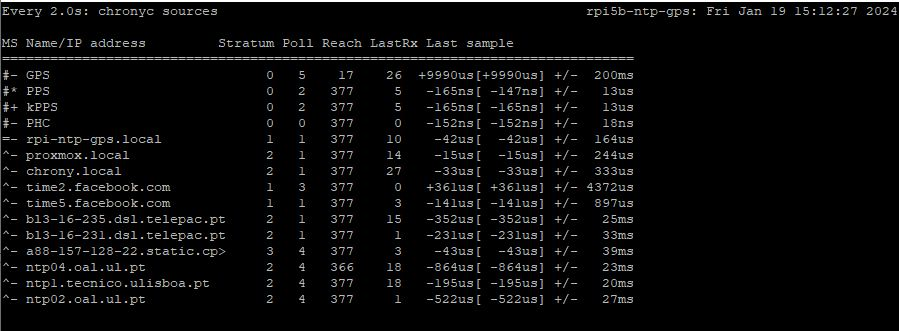

That`s all! :-)

# References
- https://store.uputronics.com/files/Uputronics%20Raspberry%20Pi%20GPS%20RTC%20Board%20Datasheet.pdf
- https://store.uputronics.com/files/UBX-13003221.pdf
- https://wiki.polaire.nl/doku.php?id=dragino_lora_gps_hat_ntp
- http://www.philrandal.co.uk/blog/archives/2019/04/entry_213.html
- https://chrony.tuxfamily.org/doc/4.2/chrony.conf.html#tempcomp
- https://hallard.me/enable-serial-port-on-raspberry-pi/
- https://gpsd.gitlab.io/gpsd/gpsd-time-service-howto.html#_arp_is_the_sound_of_your_server_choking
- https://dimon.ca/how-to-build-own-stratum-1-ntp-server/#h.1kdm8ehjrplc
- https://psychogun.github.io/docs/linux/Stratum-1-NTP-Server-using-Raspberry-Pi/
- https://chrony.tuxfamily.org/faq.html#_how_can_i_improve_the_accuracy_of_the_system_clock_with_ntp_sources
- https://tf.nist.gov/general/pdf/2871.pdf
- https://chrony-project.org/comparison.html *(good reference on why I choose chrony over ntpd)*
- https://dotat.at/@/2023-05-26-whence-time.html *(time chain of service)*
- https://forums.raspberrypi.com/viewtopic.php?p=2171999&hilit=serial+gpio+14#p2172274 *(undocumented hardware UART command for Rpi 5B)*
- https://www.dzombak.com/blog/2023/12/Mitigating-hardware-firmware-driver-instability-on-the-Raspberry-Pi.html
- https://www.dzombak.com/blog/2023/12/Disable-or-remove-unneeded-services-and-software-to-help-keep-your-Raspberry-Pi-online.html
- https://www.dzombak.com/blog/2023/12/Stop-using-the-Raspberry-Pi-s-SD-card-for-swap.html
- https://access.redhat.com/sites/default/files/attachments/201501-perf-brief-low-latency-tuning-rhel7-v2.1.pdf *(impressive guide aiming low latency on linux OS)*
- https://blog.dan.drown.org/nic-interrupt-coalesce-impact-on-ntp/
- https://quantum5.ca/2023/01/26/microsecond-accurate-time-synchronization-lan-with-ptp/
