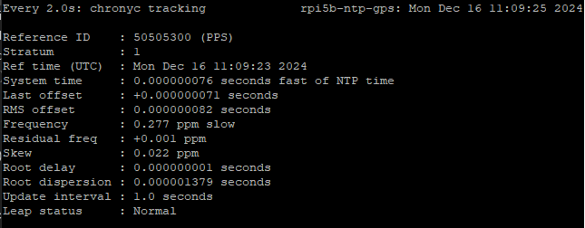
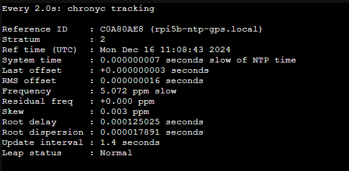

# Raspberry Pi 5B NTP Server - Stratum 1 (with Uputronics GPS HAT)
A straightforward and highly optimized approach to achieve a cost-effective (€200) and high performance Stratum 1 NTP server, disciplined with highly precise PPS (Pulse Per Second) sourced from the GNSS radio service plus NTP public servers across the internet to get the absolute time reference.

Can be prepared to be used with *off-the-grid* applications such as IoT in remote locations/air-gapped systems or WAN connected IoT ones (as presented here).

The end result with a fully assembled Raspberry Pi 5B and an Uputronics GPS/RTC HAT Ublox M8 engine vs 6.4:

This is my recipe for Raspberry Pi OS `lite` version `Bookworm`, freshly installed, with kernel 6.1.73-1+rpt1.

# Index

- [Achievements](./README.md#achievements--january-2024)
- [Optimizations](./README.md#optimizations--january-2024)
- [Sample Metrics](./README.md#sample-metrics) 
- [List of materials and tools needed](./README.md#list-of-materials-and-tools-needed)
- [Step-by-step tutorial](./README.md#step-by-step-tutorial)
- [Acknowledgments](./README.md#acknowledgments)
- [References](./README.md#references)

## Achievements @ January 2024:

| Scope         | Achievement   |   Value    |
| ------------- |:-------------:| ---------: |
| Timekeeping   | Precision     | ~ 2^(-26) s |
| Timekeeping   | PPS Jitter    |  < 400 ns  |
| Timekeeping   | Frequency     |  < 200 ppb |
| Service       | Clients       |  > 160     |
| Service       | RMS offset    |  < 100 ns  |

## Optimizations @ January 2024:

*(non exaustive)*

- Chrony software optimization:
  - Enabled DSCP higher priority packet stamping for reduced latency and jitter over the network time distribution;
  - Enabled Hardware Timestamping over the ethernet BCM54213 PHY;
  - Enabled directive to lock chronyd into RAM;
  - Implemented temperature compensation, aiming reduced frequency value and its lower jitter.
- Hardware optimization:
  - Low latency hardware UART for NMEA messages;
  - Forced constantly CPU clock and governor to its higher frequency for higher timekeeping resolution;
  - Disabled WiFi and Bluetooth radios aiming lower eletromagnetic interferance against the GNSS radio;
  - Reduced to the minimum coalescence values on the ethernet interface, for lower latency and jitter over the network time distribution;
  - Enabled the usage of the ethernet PHC clock, as a secondary high precision reflock;
  - Designed a custom case, with better hot airflow output and with higher thermal insulation for the oscilators on the Rpi 5B buttom face.
- Operating system fine tuning:
  - Disabled linux kernel power saving method, aiming reduced processes scheduling latency and jitter;
  - Increased Chrony services to `-10` nice value, aiming higher process schedule priority for better timekeeping;
  - Disabled unnecessary services, reducing CPU time consumption, latency and jitter;
  - Disabled SWAP partition usage for lower file system and memory latency, over the SD Card.
- Ublox M8 chip fine tuning:
  - Enabled support for GALILEO GNSS for better UTC time reference;
  - Disabled support for SBAS (reducing PPS jitter) and GLONASS GNSS (#slavaukraini);
  - Enabled jamming/interferance monitoring for superior GNSS continuity;
  - Enabled stationary dynamic model aiming reduced NMEA and PPS latency and jitter;
  - Set the power management to full power, reducing latency and jitter;
  - Set the antenna cable lenght latency for a better PPS time sync accuracy against UTC reference time.

## Sample metrics:

Chrony vs 4.5 `server` tracking statistics after 1 day of uptime:

Chrony vs 4.0 `client` tracking statistics after 1 day of uptime:

Chrony vs 4.0 `client` tracking ntpdata of this server, after 1 day of uptime:

# List of materials and tools needed

**Mandatory**:
- 40 pin header 10mm spacer (if using the genuine active cooler)
- SD Card with 8GB or more
- USB SD Card reader or other similar device to install Raspberry Pi OS on the SD Card.
- Raspberry Pi 5B, with a suitable power adaptor
- Uputronics GPS HAT
- RJ45 Ethernet CAT5 (or better) cable with proper lenght

**Optional** :
- 3D printed case for housing the fully assembled server **(RPi 5B)**:
  > I suggest this [custom made case](./files/Rpi%205b%20case%20all%20v3.3mf).
  
  > PLA or PETG are generally appropriate, depending on the ambient temperature and environment you`ll apply this server in.
- Outdoor GPS active antenna with 28dB Gain, inline powered at 3-5V DC, with 5 meters of cable lenght and SMA male connector

# Step-by-step tutorial
For this tutorial, you have 3 major steps. Being the last 2 of them optional, but highly recommended, as achieves huge and superior accuracy and precision.

1. [Setup the server](./steps/setup_the_server.md)
2. [Advanced Ublox M8 tuning](./steps/advanced_ublox_m8_tuning.md)
3. [Advanced system tuning](./steps/advanced_system_tuning.md)

# Acknowledgments

1. Conor Robinson, for his cooperation and shared knowledge
2. Anthony Stirk, for his openess to help and cooperate on a further hardware improvement *(stay tuned!)*

# References
- https://conorrobinson.ie/raspberry-pi-ntp-server-part-6/
- https://github.com/raspberrypi/linux/pull/5884 *(RV3028 `backup-switchover-mode` value definitions)*
- https://store.uputronics.com/files/Uputronics%20Raspberry%20Pi%20GPS%20RTC%20Board%20Datasheet.pdf
- https://store.uputronics.com/files/UBX-13003221.pdf *or* https://content.u-blox.com/sites/default/files/products/documents/u-blox8-M8_ReceiverDescrProtSpec_UBX-13003221.pdf
- https://wiki.polaire.nl/doku.php?id=dragino_lora_gps_hat_ntp
- http://www.philrandal.co.uk/blog/archives/2019/04/entry_213.html
- https://chrony.tuxfamily.org/doc/4.2/chrony.conf.html#tempcomp
- https://hallard.me/enable-serial-port-on-raspberry-pi/
- https://gpsd.gitlab.io/gpsd/gpsd-time-service-howto.html#_arp_is_the_sound_of_your_server_choking
- https://dimon.ca/how-to-build-own-stratum-1-ntp-server/#h.1kdm8ehjrplc
- https://psychogun.github.io/docs/linux/Stratum-1-NTP-Server-using-Raspberry-Pi/
- https://chrony.tuxfamily.org/faq.html#_how_can_i_improve_the_accuracy_of_the_system_clock_with_ntp_sources
- https://tf.nist.gov/general/pdf/2871.pdf
- https://chrony-project.org/comparison.html *(good reference on why I choose chrony over ntpd)*
- https://dotat.at/@/2023-05-26-whence-time.html *(time chain of service)*
- https://forums.raspberrypi.com/viewtopic.php?p=2171999&hilit=serial+gpio+14#p2172274 *(undocumented hardware UART command for Rpi 5B)*
- https://www.dzombak.com/blog/2023/12/Mitigating-hardware-firmware-driver-instability-on-the-Raspberry-Pi.html
- https://www.dzombak.com/blog/2023/12/Disable-or-remove-unneeded-services-and-software-to-help-keep-your-Raspberry-Pi-online.html
- https://www.dzombak.com/blog/2023/12/Stop-using-the-Raspberry-Pi-s-SD-card-for-swap.html
- https://access.redhat.com/sites/default/files/attachments/201501-perf-brief-low-latency-tuning-rhel7-v2.1.pdf *(impressive guide aiming low latency on linux OS)*
- https://blog.dan.drown.org/nic-interrupt-coalesce-impact-on-ntp/
- https://quantum5.ca/2023/01/26/microsecond-accurate-time-synchronization-lan-with-ptp/
- https://www.satsignal.eu/ntp/Raspberry-Pi-ntpheat.html
