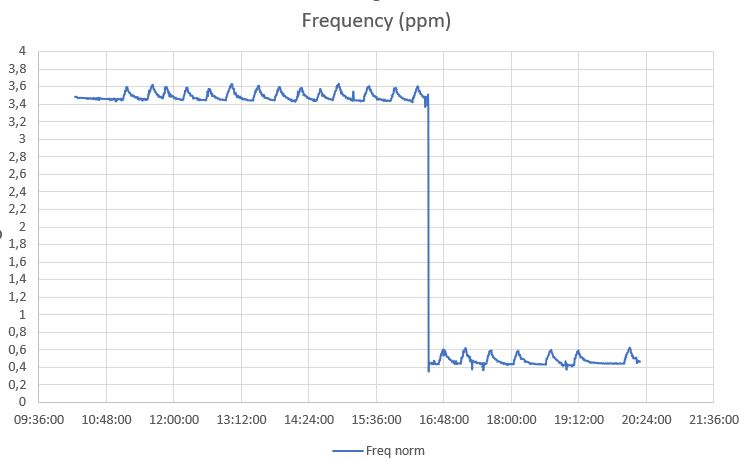

# Advanced system tuning

> [!WARNING] 
> This is optional! Proceed with caution and at your own risk!

## Check and acknowledge the logical topology of your particular SoC setup, on the PNG image generated
> sudo apt update && sudo apt install hwloc -y
>
> lstopo --logical --output-format png > \`hostname\`.png

## Check and acknowledge the pinout of this GPS HAT
- GPS Expansion Board from Uputronics: https://pinout.xyz/pinout/uputronics_gps_expansion_board

## Improve Chrony process priority, using systemd
Due to the Chrony software has not the mechanism to reduce itself its `nice` process value, we'll force it through systemd:

> sudo sed -i '/\[Service\]/a Nice=-10' /usr/lib/systemd/system/chrony.service
>
> sudo systemctl daemon-relead
> 
> sudo systemctl restart chrony


## Disable and stop unnecessary services, reducing cpu time consumption, latency and jitter
> sudo systemctl disable --now alsa-restore.service
>
> sudo systemctl disable --now alsa-state.service
>
> sudo systemctl disable --now alsa-utils.service
>
> sudo systemctl disable --now apt-daily-upgrade.timer
>
> sudo systemctl disable --now apt-daily.timer
>
> sudo systemctl mask apt-daily-upgrade.service
>
> sudo systemctl mask apt-daily.service
>
> sudo systemctl disable --now avahi-daemon.service
>
> sudo systemctl disable --now bluetooth.service
>
> sudo systemctl disable --now bthelper@.service
>
> sudo systemctl disable --now triggerhappy.service
>
> sudo systemctl disable --now rpi-display-backlight.service
>
> sudo systemctl disable --now systemd-timesyncd.service
>
> sudo systemctl disable --now wpa_supplicant.service
>
> sudo systemctl disable --now x11-common.service

## Allocate the strictly minimum RAM from GPU to the OS system, as running headless
Add this to your `/boot/firmware/config.txt` file under the `[ALL]`section:

```
# Allocates the base minimum gpu memory, as running headless
gpu_mem=16mb
``` 

## De-activates sound, aiming less resources and latency expected, as running headless
Change this on your `/boot/firmware/config.txt` file, to:

```
# De-activates sound, aiming less resources, fewer latency and interferance expected, for a headless server
dtparam=audio=off
```

## Auto-restart 10 seconds after a Kernel panic
The Raspberry Pi OS does not have this setting, useful in extreme cases, forcing a full system restart.

> echo "kernel.panic = 10" | sudo tee /etc/sysctl.d/90-kernelpanic-reboot.conf >/dev/null


## Remove the unneeded support for 2G/3G/4G/5G modems

> sudo apt remove --purge modemmanager -y
> 
> sudo apt autoremove --purge -y

## Disable the support for Swap
> sudo nano /boot/firmware/cmdline.txt

Add this ```noswap```, after this ```rootfstype=ext4```, and save.

## Disable sdcard swapping for improving its lifespan and reducing unnecessary I/O latency

> sudo dphys-swapfile swapoff
>
> sudo dphys-swapfile uninstall
>
> sudo update-rc.d dphys-swapfile remove
>
> sudo reboot

## Reducing ethernet coalescence on RX and TX

Every ethernet adaptor uses the coalescence method to gather packets and sent them on a bulk, for better thoughput efficiecy. 

But this method introduces valuable latency and jitter on NTP or PTP-E2E packets.

Check the defaults:
> sudo ethtool -c eth0

```
Coalesce parameters for eth0:
Adaptive RX: n/a  TX: n/a
stats-block-usecs: n/a
sample-interval: n/a
pkt-rate-low: n/a
pkt-rate-high: n/a

rx-usecs: 49
rx-frames: n/a
rx-usecs-irq: n/a
rx-frames-irq: n/a

tx-usecs: 49
tx-frames: n/a
tx-usecs-irq: n/a
tx-frames-irq: n/a

rx-usecs-low: n/a
rx-frame-low: n/a
tx-usecs-low: n/a
tx-frame-low: n/a

rx-usecs-high: n/a
rx-frame-high: n/a
tx-usecs-high: n/a
tx-frame-high: n/a

CQE mode RX: n/a  TX: n/a
```

Both `rx-usecs` and `tx-usecs` have the value "49" microseconds. For reference, an Intel i225-LM network card, has `rx-usecs` of "3" microseconds.

We'll set both to the mininum accepted by the Rpi 5B ethernet driver:
> sudo ethtool -C eth0 tx-usecs 4
>
> sudo ethtool -C eth0 rx-usecs 4

To revert to the default values:

> sudo ethtool -C eth0 tx-usecs 49
>
> sudo ethtool -C eth0 rx-usecs 49

This could shave *circa* 40 usecs of response time over the `chrony ntpdata` statistics. Huge improvement on a NTP setup that has hardware timestamping and its higher accuracy.

### Setting with persistance through a systemd Service

Create the systemd service configuration file:
> sudo nano /etc/systemd/system/eth-coalesce.service

Insert the following settings in it:

```
[Unit]
Description=Configure Ethernet interface Coalesce setting using ethtool
After=network.target

[Service]
Type=oneshot
RemainAfterExit=yes
ExecStart=/usr/sbin/ethtool -C eth0 tx-usecs 4 rx-usecs 4
ExecStop=/usr/sbin/ethtool -C eth0 tx-usecs 48 rx-usecs 48
 
[Install]
WantedBy=multi-user.target
```

Enable the service and start it:
> sudo systemctl enable eth-coalesce.service
> 
> sudo systemctl start eth-coalesce.service

## Chrony temperature compensation - turning the your Rpi 5B into a quasi-TCXO

Using [this python code](https://www.satsignal.eu/ntp/Raspberry-Pi-ntpheat.html), I made a fast and empirical follow-up of the system clock frequency reported by `chrony tracking` over a range of temperatures, between 45ºC and 61ºC. Noticed a function minimum around 52ºC.

So, I traced the relationship data between CPU temperature and the system clock frequency, using [this bash code](./files/log_temp_freq_24h_v1.sh), over several hours. 

For better accuracy, I created a hystheric temperature cycle using the fan control overlays, on `/boot/firmware/config.txt`:

```
## New testing Pi 5B PWN fan control setpoints - your mileage may vary
dtparam=fan_temp0=48000
dtparam=fan_temp0_hyst=4000
dtparam=fan_temp0_speed=75

dtparam=fan_temp1=53000
dtparam=fan_temp1_hyst=6000
dtparam=fan_temp1_speed=125

dtparam=fan_temp2=56000
dtparam=fan_temp2_hyst=5000
dtparam=fan_temp2_speed=200

dtparam=fan_temp3=60000
dtparam=fan_temp3_hyst=5000
dtparam=fan_temp3_speed=250
```

Then, fitted a quadratic curve to the data and calculated the system clock correction with a 0.5ºC resolution, using a spreadsheet.

Replaced the [data](../files/tempcomp_v1_24012024.txt) within `/etc/chrony/chrony.tempcomp` file, previously created, and restarted chrony.

Is quite clear the adjustment of temperature compensation:




## Enable support for PTP Hardware Clock (PHC) on the Ethernet chip

Raspberry Pi 5 has a PTP clock within the Ethernet chip, so we leverage that to have another high performance reference clock in Chrony. 

As chronyd does	not synchronise	the NIC	clock, it assumes the clock is running free. So, we need to use ptp4l and phc2sys to sync the PHC with the system time.

> sudo apt update && sudo apt install linuxptp -y

Create a new file `/etc/linuxptp/ptp4l.conf` just with this:

> sudo nano /etc/linuxptp/ptp4l.conf

```
[global]
# Only syslog every 1024 seconds
summary_interval 10

# Increase priority to allow this server to be chosen as the PTP grandmaster.
priority1 10
priority2 10

[eth0]
# My LAN does not have hardware switches compatible with Layer-2 PTP, just Layer-3 PTP.
network_transport UDPv4
delay_mechanism E2E
```

Create a systemd service for ptp4l:

> sudo nano /etc/systemd/system/ptp4l.service

Add this:

```
[Unit]
Description=Precision Time Protocol service
Documentation=man:ptp4l
After=network-online.target

[Service]
Type=simple
ExecStart=/usr/sbin/ptp4l -f /etc/linuxptp/ptp4l.conf
Nice=-10

[Install]
WantedBy=multi-user.target
```

Then, enable and start the ptp4l service:

> sudo systemctl enable --now ptp4l.service


Create a systemd service for phc2sys:

> sudo nano /etc/systemd/system/phc2sys.service

```
[Unit]
Description=Synchronizing PTP Hardware Clock from system time
Documentation=man:phc2sys
After=ptp4l.service

[Service]
Type=simple
ExecStart=/usr/sbin/phc2sys -s CLOCK_REALTIME -c eth0 -w -u 1024
Nice=-10

[Install]
WantedBy=multi-user.target
```

Then, enable and start the phc2sys service:

> sudo systemctl enable --now phc2sys.service


Add this new `refclock` into the 

>  sudo nano /etc/chrony/chrony.conf

```
refclock PHC /dev/ptp0 tai refid PHC poll 0
```

Check under the `sources` that your new `refclock` is working properly.


